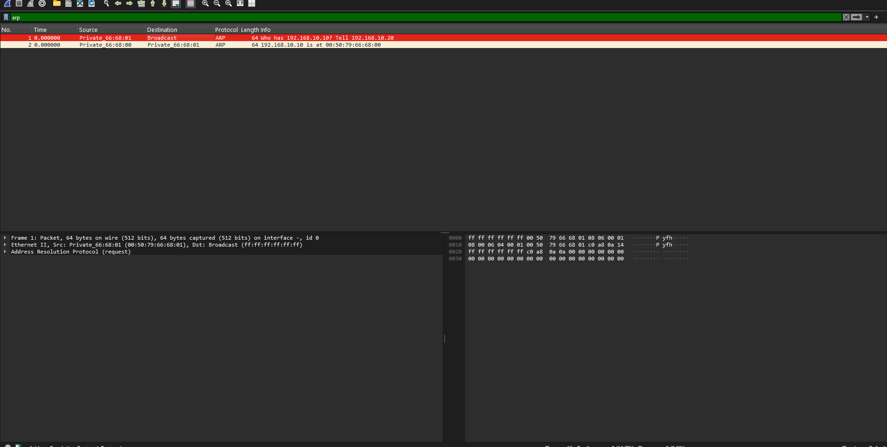
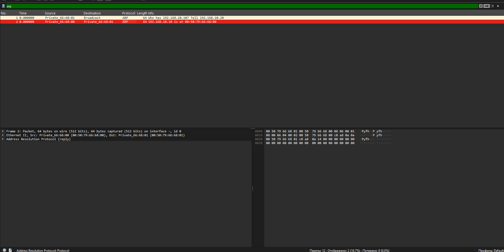
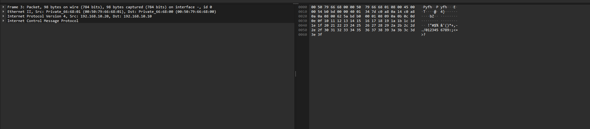
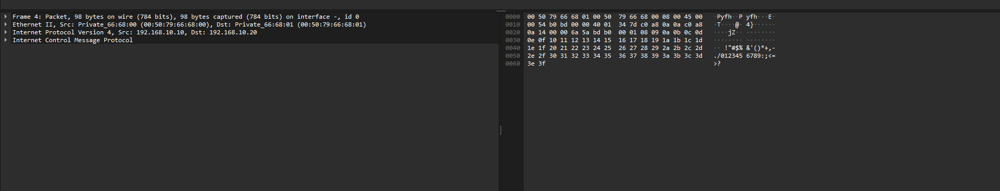
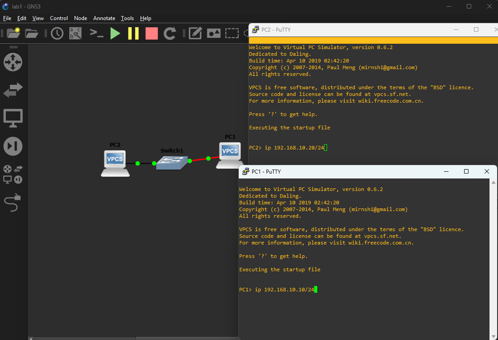

# Лабораторная работа 1 — «Первый сетевой стенд»

**Аннотация:** в этой лабораторной работе студент подготавливает учебную среду GNS3 и Wireshark, собирает первый минимальный сетевой стенд, выполняет первый захват трафика и на практике наблюдает, как связаны канальный и сетевой уровни при обмене ARP и ICMP.

---

## Содержание

1. [Chapter I](#chapter-i) \
   1.1. [Рекомендации к работе](#рекомендации-к-работе)
2. [Chapter II](#chapter-ii) \
   2.1. [Теоретические основы лабораторной работы](#теоретические-основы-лабораторной-работы) \
   2.2. [Общие сведения о GNS3, VPCS и Ethernet Switch](#общие-сведения-о-gns3-vpcs-и-ethernet-switch) \
   2.3. [Общие сведения о Wireshark](#общие-сведения-о-wireshark) \
   2.4. [Установка программного обеспечения](#установка-программного-обеспечения) \
   2.5. [Полезные материалы](#полезные-материалы)
3. [Chapter III](#chapter-iii) \
   3.1. [Общие требования к отчётам](#общие-требования-к-отчётам)
4. [Chapter IV](#chapter-iv) \
   4.1. [Задание 1. Подготовка среды и построение стенда](#задание-1-подготовка-среды-и-построение-стенда) \
   4.2. [Задание 2. Проверка связности и получение захвата](#задание-2-проверка-связности-и-получение-захвата) \
   4.3. [Задание 3. Анализ захваченного трафика](#задание-3-анализ-захваченного-трафика)

### Введение

>Утро началось подозрительно спокойно. Ты заходишь в лабораторию МАИ с надеждой, что сегодня всё ограничится теорией и парой безобидных определений про OSI. Но на столе уже открыт GNS3, рядом запущен Wireshark, а преподаватель с таким довольным видом произносит фразу «сейчас соберём самый простой стенд», что сразу становится ясно: лёгкой жизни больше не будет.
>
>Сначала кажется, что задача совсем простая: два виртуальных узла, один коммутатор, один `ping`. Но именно на таких «простых» вещах сеть и любит показывать характер. Перед первым ICMP-эхо внезапно появляется ARP, кадры начинают жить своей жизнью, а Wireshark требует не просто смотреть, а понимать, что именно ты видишь. Поэтому первая лабораторная и нужна как нормальная точка входа: без спешки собрать минимальную сеть, увидеть базовые протоколы в деле и начать воспринимать сетевой обмен не как магию, а как последовательность вполне конкретных действий.

## Цель работы

Целью лабораторной работы является получение первичных практических навыков работы со средами GNS3 и Wireshark, построение простейшего виртуального сетевого стенда, выполнение первого захвата трафика и анализ обмена данными на канальном и сетевом уровнях.

В результате выполнения лабораторной работы студент должен уметь:

1. объяснять различие между канальным и сетевым уровнями;
2. собирать в GNS3 простой стенд из двух узлов и коммутатора;
3. назначать IP-адреса виртуальным узлам;
4. проверять связность с помощью `ping`;
5. выполнять захват трафика в Wireshark;
6. находить в захвате `ARP Request`, `ARP Reply`, `ICMP Echo Request` и `ICMP Echo Reply`;
7. выписывать ключевые поля кадров и пакетов;
8. оформлять отчёт по единым требованиям курса.

## Chapter I

### Рекомендации к работе

Как работать с лабораторной:

- Выполняй работу последовательно: сначала установка и проверка среды, затем сборка стенда, затем захват и только после этого анализ.
- Не ограничивайся только текстом отчёта: преподаватель должен иметь возможность открыть проект GNS3 и файл захвата.
- Перед началом работы подготовь отдельную директорию для проекта и заранее продумай структуру хранения материалов.
- Если в ходе выполнения используется внешняя помощь, обязательно доведи каждое решение до собственного понимания.
- При работе с захватом не старайся сразу анализировать все пакеты подряд: сначала найди нужный тип трафика фильтром, затем открой конкретный кадр и только потом выписывай поля.

Как оформлять результат:

- Отчёт должен читаться как цельный документ, а не как набор разрозненных скриншотов и подписей.
- В каждом практическом шаге нужно фиксировать только те результаты, которые действительно подтверждают выполнение задания.
- Термины `Ethernet`, `ARP`, `IP`, `ICMP`, `MAC-адрес`, `IP-адрес`, `broadcast`, `unicast` следует использовать корректно и по смыслу.

## Chapter II

### Теоретические основы лабораторной работы

#### Зачем в сетях используется многоуровневый подход

Компьютерные сети являются сложными системами, в которых одновременно взаимодействуют разнородное оборудование, разные операционные системы, различные среды передачи данных и множество программных протоколов. Именно поэтому в теории сетей применяется принцип декомпозиции: общая задача связи разбивается на несколько более простых подзадач, каждая из которых решается на своём уровне.

Многоуровневый подход позволяет упростить проектирование сетей, разделить функции между независимыми частями системы, обеспечить совместимость оборудования и программного обеспечения разных производителей, а также облегчить сопровождение и развитие сетевой инфраструктуры.

В теории сетей различают три фундаментальных понятия:

- **сервис** описывает, какие функции реализует уровень;
- **интерфейс** определяет, какие операции нижний уровень предоставляет верхнему;
- **протокол** задаёт правила и соглашения, по которым одноимённые уровни на разных узлах обмениваются данными.

#### Модели OSI и TCP/IP

В сетевых технологиях широко используются две модели: модель OSI и модель TCP/IP.

Модель OSI является эталонной семиуровневой моделью. Она используется как теоретическая основа для описания сетевого взаимодействия. В ней выделяют физический, канальный, сетевой, транспортный, сеансовый, представительский и прикладной уровни.

Модель TCP/IP является практически применяемой моделью, лежащей в основе современных сетей и Интернета. В упрощённом виде в ней выделяют уровень доступа к сети, уровень межсетевого взаимодействия, транспортный и прикладной уровни.

Для данной лабораторной работы особенно важны нижние уровни. На канальном уровне используются кадры и MAC-адреса, на сетевом уровне используются пакеты и IP-адреса. В рамках первой лабораторной работы студент непосредственно наблюдает Ethernet как технологию канального уровня, IPv4 как протокол сетевого уровня и ICMP как служебный протокол, работающий поверх IP.

#### Инкапсуляция данных

Одним из ключевых понятий лабораторной работы является инкапсуляция. Инкапсуляция означает, что данные верхнего уровня передаются не сами по себе, а вкладываются в блок данных нижнего уровня.

Например, при отправке команды `ping` сначала формируется сообщение `ICMP Echo Request`, затем оно помещается внутрь IP-пакета, а затем IP-пакет помещается внутрь Ethernet-кадра. Именно поэтому при анализе одного и того же кадра в Wireshark можно одновременно увидеть поля Ethernet, затем IP и затем ICMP.

Наблюдение инкапсуляции связывает теорию уровней сети с реальным анализом трафика. Это одна из главных идей лабораторной работы: студент должен увидеть не только конечный результат, но и внутреннее устройство сетевого обмена.

#### Ethernet и кадр канального уровня

В данной лабораторной работе используется Ethernet как технология локальной сети. На канальном уровне данные передаются в виде кадров. Кадр Ethernet II содержит несколько ключевых полей:

| Поле | Назначение |
|---|---|
| `Destination MAC` | MAC-адрес назначения |
| `Source MAC` | MAC-адрес источника |
| `EtherType` | тип вложенного протокола |
| `Payload` | полезная нагрузка |
| `FCS` | контрольная последовательность кадра |

Поле `EtherType` показывает, какой протокол вложен в кадр. Например, значение `0x0806` соответствует `ARP`, а значение `0x0800` соответствует `IPv4`.

Коммутатор работает на канальном уровне и принимает решение о пересылке кадра, ориентируясь на MAC-адрес назначения. Следовательно, до передачи IP-пакета по локальной сети узел должен сначала узнать MAC-адрес получателя.

#### MAC-адрес и IP-адрес

MAC-адрес является адресом сетевого интерфейса на канальном уровне. Он используется для доставки кадров в пределах локального сегмента сети. В Ethernet обычно применяется 48-битный MAC-адрес, записываемый в шестнадцатеричном виде.

IP-адрес является логическим адресом узла на сетевом уровне. Он нужен для идентификации узла в пределах сети или между сетями. В данной лабораторной работе используется IPv4-адресация.

Принципиальная разница между этими адресами такова:

- MAC-адрес необходим для доставки кадра внутри локальной сети;
- IP-адрес необходим для логической идентификации отправителя и получателя на сетевом уровне.

Именно поэтому перед отправкой IP-пакета по Ethernet узел должен определить соответствующий MAC-адрес получателя.

#### Протокол ARP

ARP (`Address Resolution Protocol`) используется для определения MAC-адреса по известному IP-адресу в пределах локальной сети.

Если узел знает IP-адрес получателя, но не знает его MAC-адрес, он отправляет `ARP Request`. Такой запрос передаётся в широковещательном Ethernet-кадре, поскольку отправителю пока неизвестно, на какой конкретный MAC-адрес нужно направить запрос. Узел, которому принадлежит искомый IP-адрес, отвечает сообщением `ARP Reply`, где сообщает свой MAC-адрес.

Таким образом, ARP обеспечивает связь между логической IP-адресацией и фактической передачей кадров Ethernet.

В захвате Wireshark обмен ARP выглядит как короткий предварительный этап перед полезным обменом данными. Именно поэтому перед первым `ping` внутри подсети обычно наблюдаются сначала `ARP Request` и `ARP Reply`, а уже затем кадры с `ICMP`.

#### Протоколы IP и ICMP

IP (`Internet Protocol`) является основным протоколом сетевого уровня. Он используется для логической адресации и межсетевой доставки пакетов. Внутри IP-пакета могут передаваться данные различных протоколов верхнего уровня.

ICMP (`Internet Control Message Protocol`) является служебным протоколом сетевого уровня. В лабораторной работе он используется через команду `ping`, которая генерирует сообщения:

- `ICMP Echo Request`;
- `ICMP Echo Reply`.

Успешный обмен такими сообщениями подтверждает наличие сетевой связности между узлами. Важно понимать, что `ping` не отменяет необходимость работы ARP: если MAC-адрес ещё не известен, сначала выполняется ARP-разрешение, и только затем передаётся `ICMP Echo Request`.

#### Что должно быть понято по итогам теории

После изучения теоретического материала студент должен понимать:

1. чем отличаются модели OSI и TCP/IP;
2. какие функции выполняет канальный уровень и какие функции выполняет сетевой уровень;
3. чем MAC-адрес отличается от IP-адреса;
4. зачем нужен ARP и почему он работает в пределах локальной сети;
5. как работает `ping`;
6. как в одном кадре наблюдается инкапсуляция `Ethernet -> IPv4 -> ICMP`.

### Общие сведения о GNS3, VPCS и Ethernet Switch

#### GNS3

GNS3 (`Graphical Network Simulator-3`) является программной средой для эмуляции, конфигурирования, тестирования и отладки виртуальных и реальных сетей. Она позволяет собирать сетевые стенды из виртуальных устройств, соединять их между собой, запускать, останавливать и анализировать их поведение.

В данной лабораторной работе GNS3 используется для построения простейшего стенда из двух узлов и одного коммутатора.

Основные элементы интерфейса GNS3:

| Элемент | Назначение |
|---|---|
| Список устройств | выбор доступных сетевых узлов |
| Рабочая область проекта | размещение и соединение устройств |
| Панель управления | запуск, остановка и перезапуск узлов |
| Консоль устройства | окно работы с конкретным узлом |
| Контекстное меню | доступ к настройке, захвату и дополнительным действиям |

#### VPCS

VPCS (`Virtual PC Simulator`) представляет собой лёгкий виртуальный ПК, предназначенный для учебных сетевых стендов. В данной лабораторной работе VPCS используется как модель конечного узла.

Основные команды VPCS:

| Команда | Назначение |
|---|---|
| `ip <адрес>/<маска>` | назначить IP-адрес и маску |
| `ip <адрес>/<маска> <шлюз>` | назначить IP-адрес, маску и шлюз |
| `show ip` | показать текущие IP-настройки |
| `ping <IP-адрес>` | проверить связность с указанным узлом |
| `ping <IP-адрес> -c <N>` | отправить `N` ICMP-запросов |
| `arp` | вывести ARP-таблицу |
| `clear arp` | очистить ARP-таблицу |
| `save` | сохранить конфигурацию |
| `?` или `help` | вывести список доступных команд |

#### Ethernet Switch в GNS3

`Ethernet Switch` в GNS3 представляет собой встроенный виртуальный коммутатор канального уровня. В рамках данной лабораторной работы он используется как узел `SW1` и обеспечивает коммутацию кадров между `PC1` и `PC2`.

Для базового стенда специальная настройка коммутатора не требуется: достаточно добавить его в проект и соединить соответствующими портами с узлами VPCS. Основная работа студента в этой лабораторной связана не с CLI коммутатора, а с пониманием того, как через него проходят кадры и почему на канальном уровне достаточно именно такого устройства.

### Общие сведения о Wireshark

Wireshark является анализатором сетевого трафика. Он позволяет выполнять захват пакетов, просматривать их состав, фильтровать трафик и исследовать поля сетевых протоколов. Программа широко применяется для диагностики сетей, обучения и исследования протоколов.

В данной лабораторной работе Wireshark используется для захвата и анализа ARP- и ICMP-кадров.

При работе с Wireshark необходимо различать три основные панели:

1. список пакетов;
2. дерево полей выбранного пакета;
3. байтовое представление пакета.

Именно эти элементы интерфейса должны быть видны в тех скриншотах, которые студент включает в отчёт при анализе трафика.

Полезные фильтры отображения для данной лабораторной работы:

| Фильтр | Назначение |
|---|---|
| `arp` | показать только ARP-кадры |
| `icmp` | показать только ICMP-пакеты |
| `ip.addr == <IP>` | отфильтровать трафик по IP-адресу |
| `eth.src == <MAC>` | отфильтровать трафик по MAC-адресу источника |
| `eth.dst == ff:ff:ff:ff:ff:ff` | показать широковещательные кадры |

### Установка программного обеспечения

Ниже приведён общий порядок установки для Windows. При использовании другой операционной системы необходимо руководствоваться официальной документацией соответствующей программы.

#### Установка GNS3

1. Перейти на официальный сайт GNS3.
2. Скачать установочный пакет для своей операционной системы.
3. Запустить установщик и принять лицензионные условия.
4. Выбрать путь установки и завершить установку.
5. Запустить GNS3 и выполнить первичную настройку.
6. Убедиться, что в списке устройств доступны `VPCS` и `Ethernet Switch`.

Для обязательной части обновлённого практикума достаточно локальной установки `GNS3` и `Wireshark`. В базовом контуре курса не требуются `GNS3 VM`, `Docker`, `Open vSwitch`, `VirtualBox`, `VMware` и внешние appliance. Если преподаватель использует расширенный контур с Linux-узлами и дополнительной виртуализацией, это должно оговариваться отдельно как дополнительный, а не обязательный вариант выполнения.

#### Установка Wireshark

1. Перейти на официальный сайт Wireshark.
2. Скачать установочный пакет для своей операционной системы.
3. Запустить установщик и установить Wireshark.
4. Установить `Npcap`, если программа предложит это сделать.
5. Запустить Wireshark и убедиться, что доступны источники захвата.

#### Проверка готовности

После установки необходимо убедиться, что:

- GNS3 запускается без ошибок;
- создаётся новый проект;
- доступны `VPCS` и `Ethernet Switch`;
- Wireshark запускается без ошибок;
- Wireshark может открыть интерфейсы захвата.

### Полезные материалы

В каталоге лабораторной находятся:

- `README.md` - основной текст лабораторной;
- `report.docx` - версия в формате Word;
- `report.pdf` - версия в формате PDF;
- `pcap/lr1_first_capture.pcapng` - пример файла захвата для анализа;
- `Ресурсы` - изображения, используемые внутри этого Markdown-файла.

## Chapter III

### Общие требования к отчётам

Данные требования применяются ко всем отчётам по лабораторным работам этого цикла. В последующих лабораторных они могут не повторяться полностью, поэтому при оформлении дальнейших работ следует ориентироваться на требования, сформулированные в лабораторной работе № 1.

В отчёте должны быть:

- титульный лист;
- цель работы;
- краткая теория по теме лабораторной;
- номер варианта и использованные исходные данные;
- схема стенда и таблица адресации;
- результаты выполнения задания;
- анализ требуемых кадров, пакетов или событий;
- вывод по работе.

Дополнительно необходимо учитывать следующее:

- если в работе используется Wireshark, скриншот анализа должен быть читаемым и содержать достаточную информацию для проверки;
- в приложениях к отчёту или в составе сдаваемых материалов должны присутствовать проект GNS3 и файл захвата, если они требуются заданием;
- подписи к рисункам и таблицам должны быть короткими, содержательными и однозначными;
- вывод должен фиксировать не только факт выполнения, но и то, какие сетевые явления были подтверждены в ходе работы.

## Chapter IV

### Задание 1. Подготовка среды и построение стенда {#задание-1-подготовка-среды-и-построение-стенда}

Для этого задания используется параметр `A`, который вычисляется по формуле:

- `A = ((N - 1) mod 4) + 1`

Вариант адресации по параметру `A`:

| `A` | Подсеть | `PC1` | `PC2` |
|---|---|---|---|
| 1 | `192.168.10.0/24` | `192.168.10.10/24` | `192.168.10.20/24` |
| 2 | `192.168.20.0/24` | `192.168.20.10/24` | `192.168.20.20/24` |
| 3 | `192.168.30.0/24` | `192.168.30.10/24` | `192.168.30.20/24` |
| 4 | `192.168.40.0/24` | `192.168.40.10/24` | `192.168.40.20/24` |

Установить GNS3 и Wireshark. Создать в GNS3 проект `LR1_First_Project`. Собрать стенд `PC1 - SW1 - PC2`. Узлы `PC1` и `PC2` должны быть выполнены на базе VPCS. Узел `SW1` должен быть выполнен с использованием встроенного `Ethernet Switch` GNS3.

Назначить IP-адреса узлам `PC1` и `PC2` в соответствии со значением параметра `A`.

В отчёт по этому заданию включить:

- схему стенда;
- таблицу адресации;
- краткое подтверждение готовности среды.

В составе сдаваемых материалов должны быть представлены:

- проект GNS3 со стендом `PC1 - SW1 - PC2`.

### Задание 2. Проверка связности и получение захвата {#задание-2-проверка-связности-и-получение-захвата}

Для этого задания используется параметр `B`, который вычисляется по формуле:

- `B = ((N - 1) mod 3) + 1`

Вариант проверки связности и точки захвата по параметру `B`:

| `B` | Направление проверки | Линк захвата |
|---|---|---|
| 1 | `PC1 -> PC2` | `PC1 - SW1` |
| 2 | `PC2 -> PC1` | `PC1 - SW1` |
| 3 | `PC1 -> PC2` | `PC2 - SW1` |

После настройки адресов выполнить проверку связности в соответствии со значением параметра `B`. Необходимо получить не менее четырёх успешных ответов подряд. Затем нужно запустить захват трафика на линке, определяемом параметром `B`, повторить ту же проверку связности, остановить захват и сохранить файл под именем `pcap/lr1_first_capture.pcapng`.

В отчёт по этому заданию включить:

- результат проверки связности;
- имя файла захвата;
- краткое описание того, на каком линке выполнялся захват.

В составе сдаваемых материалов должен быть представлен:

- файл `pcap/lr1_first_capture.pcapng`.

### Задание 3. Анализ захваченного трафика {#задание-3-анализ-захваченного-трафика}

Для этого задания используется параметр `C`, который вычисляется по формуле:

- `C = ((N - 1) mod 5) + 1`

Вариант аналитического пункта по параметру `C`:

- `C = 1` - объяснить, почему `ARP Request` является широковещательным кадром.
- `C = 2` - сравнить MAC-адрес назначения в `ARP Request` и `ICMP Echo Request`.
- `C = 3` - пояснить, почему перед обменом ICMP в захвате появляется ARP.
- `C = 4` - показать, где в выбранном пакете заканчивается канальный уровень и начинается сетевой.
- `C = 5` - вручную описать инкапсуляцию одного `ICMP Echo Request`.

В файле `pcap/lr1_first_capture.pcapng` необходимо найти по одному кадру каждого из указанных типов и оформить результаты в отчёте.

| Объект анализа | Что должно быть приведено в отчёте |
|---|---|
| `ARP Request` | номер кадра, `Ethernet Source MAC`, `Ethernet Destination MAC`, `ARP Sender IP`, `ARP Target IP` |
| `ARP Reply` | номер кадра, `Ethernet Source MAC`, `Ethernet Destination MAC`, `ARP Sender IP`, `ARP Target IP` |
| `ICMP Echo Request` | номер кадра, `Ethernet Source MAC`, `Ethernet Destination MAC`, `IP Source`, `IP Destination`, `ICMP Type` |
| `ICMP Echo Reply` | номер кадра, `Ethernet Source MAC`, `Ethernet Destination MAC`, `IP Source`, `IP Destination`, `ICMP Type` |
| Аналитический пункт по параметру `C` | пояснение в соответствии со своим вариантом |

В отчёт по этому заданию включить:

- разбор `ARP Request`;
- разбор `ARP Reply`;
- разбор `ICMP Echo Request`;
- разбор `ICMP Echo Reply`;
- выполнение аналитического пункта по параметру `C`;
- краткий вывод по результатам анализа.

В составе сдаваемых материалов должны быть представлены:

- файл `pcap/lr1_first_capture.pcapng`;
- проект GNS3, использованный при выполнении работы.
