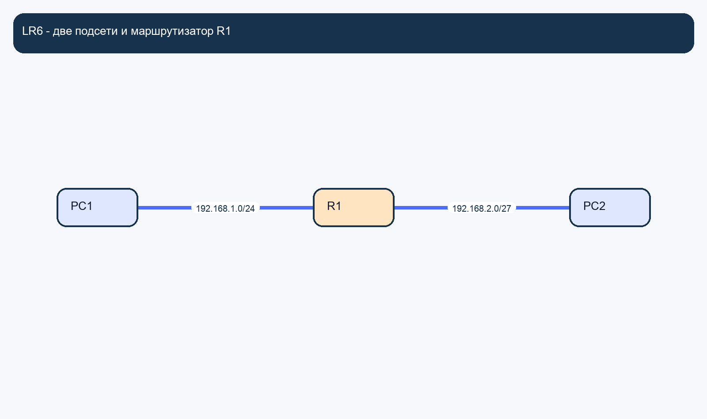
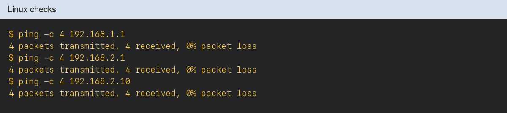
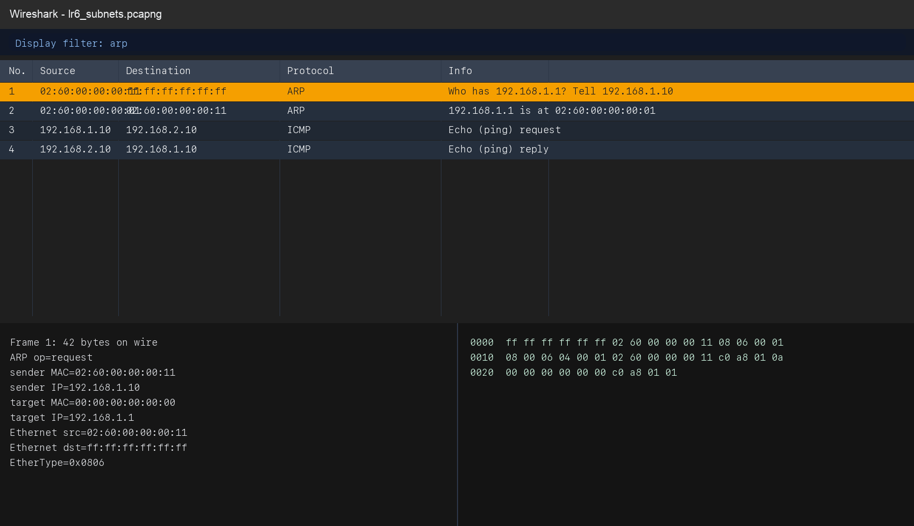
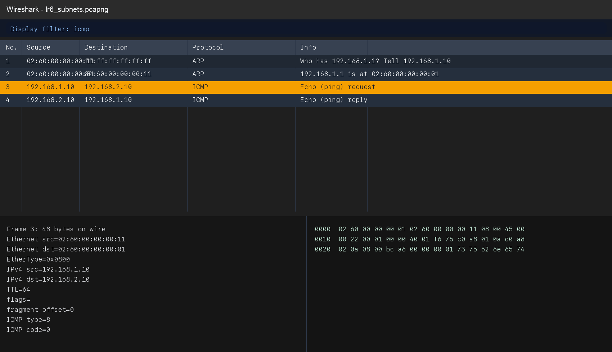

# Лабораторная работа 6 — «Границы подсети»

**Аннотация:** в этой лабораторной работе студент рассчитывает параметры IPv4-подсетей, собирает маршрутизируемый стенд из двух сегментов и по захвату трафика доказывает, что ARP остаётся локальным, а ICMP проходит через маршрутизатор.

---

## Содержание

1. [Chapter I](#chapter-i) \
   1.1. [Рекомендации к работе](#рекомендации-к-работе)
2. [Chapter II](#chapter-ii) \
   2.1. [Теоретические основы лабораторной работы](#теоретические-основы-лабораторной-работы) \
   2.2. [Общие сведения о GNS3 и Linux-узлах](#общие-сведения-о-gns3-и-linux-узлах) \
   2.3. [Общие сведения о Wireshark](#общие-сведения-о-wireshark) \
   2.4. [Полезные материалы](#полезные-материалы)
3. [Chapter III](#chapter-iii) \
   3.1. [Общие требования к отчётам](#общие-требования-к-отчётам)
4. [Chapter IV](#chapter-iv) \
   4.1. [Задание 1. Расчёт подсетей](#задание-1-расчёт-подсетей) \
   4.2. [Задание 2. Сборка стенда и настройка адресов](#задание-2-сборка-стенда-и-настройка-адресов) \
   4.3. [Задание 3. Включение маршрутизации на R1](#задание-3-включение-маршрутизации-на-r1) \
   4.4. [Задание 4. Проверка связности](#задание-4-проверка-связности) \
   4.5. [Задание 5. Захват и анализ трафика](#задание-5-захват-и-анализ-трафика) \
   4.6. [Задание 6. Аналитическая часть](#задание-6-аналитическая-часть)

### Введение

>IP-адрес кажется простым, пока не нужно объяснить, где заканчивается одна сеть и начинается другая. Как только в схеме появляется маршрутизатор, сразу выясняется, что один и тот же пакет подчиняется сразу двум логикам: локальной адресации через ARP и межсетевой доставке через IP. Эта лабораторная работа нужна именно для того, чтобы увидеть эту границу не на рисунке, а в живом трафике.

## Цель работы

Целью лабораторной работы является закрепление навыков работы с IPv4-адресацией, масками и префиксами, а также практическое подтверждение того, что ARP работает только внутри локального сегмента, а межсетевой обмен выполняется через маршрутизатор.

В результате выполнения лабораторной работы студент должен уметь:

1. вычислять network address и broadcast address;
2. определять диапазон допустимых адресов хостов;
3. различать адресацию в сетях `/24` и `/27`;
4. настраивать Linux-узлы и маршрутизатор в GNS3;
5. включать IP forwarding;
6. проверять связность внутри подсети и между подсетями;
7. анализировать ARP и ICMP на линке с маршрутизатором;
8. объяснять, почему ARP не пересекает границы подсетей.

## Chapter I

### Рекомендации к работе

Как работать с лабораторной:

- Начинай лабораторную с расчёта подсетей, а не с настройки узлов.
- Проверяй адреса, маски и шлюзы до начала захвата.
- Захват выполняй на линке между хостом и маршрутизатором, иначе ключевая логика будет менее наглядной.
- В отчёте явно отделяй локальный ARP-обмен от межсетевого ICMP.

Как оформлять результат:

- Отчёт должен читаться как цельный документ.
- Термины `network address`, `broadcast address`, `default gateway`, `IP forwarding`, `ARP`, `ICMP` следует использовать корректно и по смыслу.

## Chapter II

### Теоретические основы лабораторной работы

#### IPv4-адрес и маска сети

IPv4-адрес состоит из 32 бит. Маска или префикс определяет, какая часть адреса относится к сети, а какая — к хосту. Например, `/24` означает, что первые 24 бита — это сетевая часть, а оставшиеся 8 бит — хостовая.

Для любой подсети необходимо уметь определять:

1. **адрес сети** (`network address`) — адрес, в котором все хостовые биты равны нулю;
2. **широковещательный адрес** (`broadcast address`) — адрес, в котором все хостовые биты равны единице;
3. **первый допустимый адрес хоста** — следующий за адресом сети;
4. **последний допустимый адрес хоста** — предшествующий широковещательному адресу.

Пример для сети `192.168.1.0/24`:

| Параметр | Значение |
|---|---|
| Адрес сети | `192.168.1.0` |
| Broadcast | `192.168.1.255` |
| Первый хост | `192.168.1.1` |
| Последний хост | `192.168.1.254` |
| Число хостов | `254` |

Пример для сети `192.168.2.0/27`:

| Параметр | Значение |
|---|---|
| Адрес сети | `192.168.2.0` |
| Broadcast | `192.168.2.31` |
| Первый хост | `192.168.2.1` |
| Последний хост | `192.168.2.30` |
| Число хостов | `30` |

Для `/24` количество адресов равно 256, для `/27` — 32. При этом крайние адреса используются как network и broadcast, поэтому число доступных хостов меньше.

#### Роль маршрутизатора

Маршрутизатор (`router`) работает на сетевом уровне и соединяет разные IP-подсети. Он принимает IP-пакет на одном интерфейсе, определяет следующий переход на основании таблицы маршрутизации и пересылает пакет на другой интерфейс.

Конечные узлы отправляют трафик в удалённую сеть через **default gateway** (шлюз по умолчанию). Перед отправкой IP-пакета к шлюзу хост использует ARP, чтобы определить MAC-адрес интерфейса маршрутизатора в своей локальной сети.

Именно поэтому маршрутизатор разделяет домены широковещания: broadcast-кадры, включая ARP-запросы, не пересекают его интерфейсы.

#### Почему ARP локален

ARP (`Address Resolution Protocol`) не маршрутизируется между сетями. Это значит, что хост не спрашивает MAC-адрес удалённого узла в другой подсети. Вместо этого он определяет MAC-адрес локального шлюза и передаёт IP-пакет ему.

Процесс отправки пакета в удалённую сеть выглядит так:

1. хост определяет, что адресат находится в другой подсети (на основании маски);
2. хост выполняет ARP-запрос к адресу шлюза по умолчанию;
3. хост получает MAC-адрес интерфейса маршрутизатора;
4. хост отправляет Ethernet-кадр с MAC-адресом маршрутизатора, но с IP-адресом удалённого узла;
5. маршрутизатор принимает кадр, извлекает IP-пакет и пересылает его дальше.

Таким образом, ARP остаётся внутри локального сегмента, а IP-маршрутизация работает между сетями. Это ключевое наблюдение, которое предстоит подтвердить в ходе лабораторной работы.

#### Что необходимо понять по итогам теории

После изучения теоретического материала студент должен понимать:

1. как вычислить network address и broadcast address;
2. чем отличаются маски `/24` и `/27`;
3. зачем нужен default gateway;
4. почему ARP не пересекает границы подсети;
5. почему ICMP может проходить между подсетями;
6. что делает IP forwarding.

### Общие сведения о GNS3 и Linux-узлах

#### Среда GNS3

В лабораторной работе используются:

- `PC1` — Linux-узел;
- `PC2` — Linux-узел;
- `R1` — Linux-узел с двумя сетевыми интерфейсами.

Такой набор позволяет наглядно показать:

1. адресацию в двух подсетях;
2. роль default gateway;
3. передачу пакета через маршрутизатор;
4. различие между ARP и ICMP в контексте межсетевого обмена.

#### Команды настройки сети на Linux-узлах

Для настройки IP-адресов и маршрутизации на Linux-узлах используются следующие команды:

| Команда | Назначение |
|---|---|
| `ip addr add <IP>/<маска> dev <интерфейс>` | назначить IP-адрес |
| `ip link set <интерфейс> up` | поднять интерфейс |
| `ip route add default via <шлюз>` | добавить маршрут по умолчанию |
| `sysctl -w net.ipv4.ip_forward=1` | включить IP forwarding |
| `ip addr show` | показать IP-адреса |
| `ip route show` | показать таблицу маршрутов |
| `ping <IP-адрес>` | проверить связность |

### Общие сведения о Wireshark

Wireshark используется для захвата и анализа ARP- и ICMP-кадров на линке `PC1 — R1`.

Полезные фильтры отображения для данной лабораторной работы:

| Фильтр | Назначение |
|---|---|
| `arp` | показать только ARP-кадры |
| `icmp` | показать только ICMP-пакеты |
| `ip.addr == 192.168.2.10` | отфильтровать трафик по IP-адресу PC2 |

### Полезные материалы

Все материалы, необходимые для сдачи и повторного просмотра лабораторной работы, включены в этот каталог:

- [Краткое задание](./assignment.md)
- [Отчёт в DOCX](./report.docx)
- [Отчёт в PDF](./report.pdf)
- [Схема стенда](./gns3/)
- [Конфигурации Linux-узлов](./configs/)
- [Файл захвата](./pcap/)
- [Скриншоты](./screenshots/)

Ключевые локальные иллюстрации:

## Chapter III

### Общие требования к отчётам

Требования к отчётам, сформулированные в лабораторной работе № 1, применяются ко всем отчётам данного цикла. Ниже приведены дополнительные требования, специфичные для данной лабораторной работы.

В отчёте должны быть:

- титульный лист;
- цель работы;
- краткая теория по теме лабораторной;
- схема стенда;
- таблица адресации;
- расчёты для подсетей `/24` и `/27`;
- скриншоты проверок связности;
- скриншоты ARP Request, ARP Reply, ICMP Echo Request и Echo Reply;
- краткий вывод.

Дополнительно необходимо учитывать следующее:

- скриншоты Wireshark должны содержать список пакетов, дерево полей и байтовое представление;
- в приложениях к отчёту должны присутствовать проект GNS3, файл захвата и текст команд настройки Linux-узлов.

## Chapter IV

### Задание 1. Расчёт подсетей

Для этого задания используется параметр `A`, который вычисляется по формуле:

- `A = ((N - 1) mod 4) + 1`

Вариант подсетей для расчёта по параметру `A`:

| `A` | Сеть LAN1 | Сеть LAN2 |
|---|---|---|
| 1 | `192.168.1.0/24` | `192.168.2.0/27` |
| 2 | `10.0.1.0/24` | `10.0.2.0/27` |
| 3 | `172.16.1.0/24` | `172.16.2.0/27` |
| 4 | `192.168.100.0/24` | `192.168.101.0/27` |

Для каждой из двух подсетей вычислить:

1. network address;
2. broadcast address;
3. диапазон адресов хостов.

В отчёт по данному заданию включить:

- расчёты для обеих подсетей;
- таблицу с результатами.

### Задание 2. Сборка стенда и настройка адресов

Для этого задания используется параметр `B`, который вычисляется по формуле:

- `B = ((N - 1) mod 4) + 1`

Вариант адресации стенда по параметру `B`:

| `B` | `PC1 eth0` | `R1 eth0` | `PC2 eth0` | `R1 eth1` |
|---|---|---|---|---|
| 1 | `192.168.1.10/24` | `192.168.1.1/24` | `192.168.2.10/27` | `192.168.2.1/27` |
| 2 | `10.0.1.10/24` | `10.0.1.1/24` | `10.0.2.10/27` | `10.0.2.1/27` |
| 3 | `172.16.1.10/24` | `172.16.1.1/24` | `172.16.2.10/27` | `172.16.2.1/27` |
| 4 | `192.168.100.10/24` | `192.168.100.1/24` | `192.168.101.10/27` | `192.168.101.1/27` |

Шлюзы по умолчанию:

- для `PC1` — адрес `R1 eth0` из столбца варианта `B`;
- для `PC2` — адрес `R1 eth1` из столбца варианта `B`.

Собрать стенд `PC1 — R1 — PC2`.

Порядок выполнения:

1. создать в GNS3 три Linux-узла (`PC1`, `PC2`, `R1`);
2. соединить `PC1(eth0) — R1(eth0)` и `PC2(eth0) — R1(eth1)`;
3. назначить IP-адреса в соответствии с таблицей варианта `B`;
4. поднять интерфейсы;
5. настроить шлюзы по умолчанию на `PC1` и `PC2`.

В отчёт по данному заданию включить:

- схему стенда;
- таблицу адресации;
- подтверждение настройки адресов.

В составе сдаваемых материалов должны быть представлены:

- проект GNS3;
- текстовые команды настройки Linux-узлов.

### Задание 3. Включение маршрутизации на R1

Для этого задания используется параметр `C`, который вычисляется по формуле:

- `C = ((N - 1) mod 3) + 1`

Вариант проверки после включения forwarding по параметру `C`:

| `C` | Проверка |
|---|---|
| 1 | Показать вывод `ip forward` и подтвердить, что значение равно `1` |
| 2 | Показать вывод `ip route` на `R1` и подтвердить наличие подключенных сетей |
| 3 | Показать вывод `sysctl net.ipv4.ip_forward` и подтвердить включение |

На `R1` необходимо:

1. включить `IP forwarding`: `sysctl -w net.ipv4.ip_forward=1`;
2. убедиться, что интерфейсы активны;
3. сохранить команды настройки;
4. выполнить проверку в соответствии с параметром `C`.

В отчёт по данному заданию включить:

- команду включения IP forwarding;
- результат проверки по параметру `C`.

### Задание 4. Проверка связности

Для этого задания используется параметр `D`, который вычисляется по формуле:

- `D = ((N - 1) mod 3) + 1`

Вариант проверок связности по параметру `D`:

| `D` | Проверка 1 | Проверка 2 | Проверка 3 |
|---|---|---|---|
| 1 | `PC1 → шлюз LAN1` | `PC2 → шлюз LAN2` | `PC1 → PC2` |
| 2 | `PC2 → шлюз LAN2` | `PC1 → PC2` | `PC2 → PC1` |
| 3 | `PC1 → PC2` | `PC2 → PC1` | `PC1 → шлюз LAN1` |

Выполнить проверки связности в соответствии с параметром `D` и включить в отчёт скриншоты или текстовые выводы каждой проверки.

### Задание 5. Захват и анализ трафика

Для этого задания используется параметр `E`, который вычисляется по формуле:

- `E = ((N - 1) mod 3) + 1`

Вариант аналитического пункта по параметру `E`:

| `E` | Аналитический пункт |
|---|---|
| 1 | Показать, что MAC-адрес назначения в ARP-запросе — это MAC шлюза, а не удалённого хоста |
| 2 | Показать, что IP-адрес назначения в ICMP-пакете — это адрес удалённого хоста, а не шлюза |
| 3 | Сравнить ARP-запрос из этой лабораторной с ARP-запросом из первой лабораторной и объяснить различие |

Порядок выполнения:

1. запустить захват на линке `PC1 — R1`;
2. выполнить `ping` `PC1 → PC2`;
3. остановить захват;
4. сохранить файл под именем `pcap/lr6_subnets.pcapng`.

В Wireshark необходимо найти:

1. `ARP Request`;
2. `ARP Reply`;
3. `ICMP Echo Request`;
4. `ICMP Echo Reply`.

Для каждого кадра необходимо выписать:

1. номер кадра;
2. MAC-адрес назначения;
3. MAC-адрес источника;
4. IP-адрес назначения;
5. IP-адрес источника;
6. назначение кадра в логике обмена.

В отчёт по данному заданию включить:

- скриншоты ARP Request, ARP Reply, ICMP Echo Request и ICMP Echo Reply;
- таблицу с полями каждого кадра;
- имя файла захвата;
- выполнение аналитического пункта по параметру `E`.

В составе сдаваемых материалов должен быть представлен:

- файл `pcap/lr6_subnets.pcapng`.

### Задание 6. Аналитическая часть

Для этого задания используется параметр `F`, который вычисляется по формуле:

- `F = ((N - 1) mod 4) + 1`

Вариант аналитического пункта по параметру `F`:

| `F` | Аналитический пункт |
|---|---|
| 1 | Почему `PC1` не определяет MAC-адрес `PC2` напрямую |
| 2 | Почему в ARP-запросе целевым IP является адрес шлюза, а не удалённого хоста |
| 3 | Почему ICMP-пакет содержит адрес удалённого хоста, а не адрес шлюза |
| 4 | Чем отличается логика ARP и логика IP-маршрутизации на примере данного стенда |

В отчёте необходимо письменно ответить на выбранный по параметру `F` аналитический пункт.

В отчёт по данному заданию включить:

- развёрнутый ответ на аналитический пункт по параметру `F`;
- итоговый вывод о границах подсети и роли маршрутизатора.
